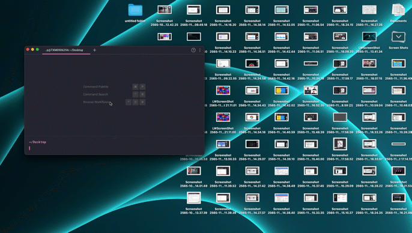

## Motivation

During participants setup their presentation for the SCB TechX's Hackathon pitching. I found that some of their desktop has plenty of screenshots, folders or some files that unnecessary their
presentation. How might we have a single command or cli without an user has to remember the command or googling command to hide their desktop icons?

## Demo



⚠️ This CLI supports only on macOS!

## Installation

First, install the cli

```bash
# npm
$ npm install -g hide-files

# yarn
$ yarn global add hide-files

# pnpm
$ pnpm add -g hide-files
```

## Usage

Then execute the command to hide your cluttered desktop icons 🤫

```bash
$ hide-files hide
```

Unhide all files and folders in Desktop

```bash
$ hide-files unhide
```

## Special Thanks 🙏


This project is inspired by the Open Source [Raycast](https://www.raycast.com/)'s [extension](https://github.com/raycast/extensions/) that is fully open source.
